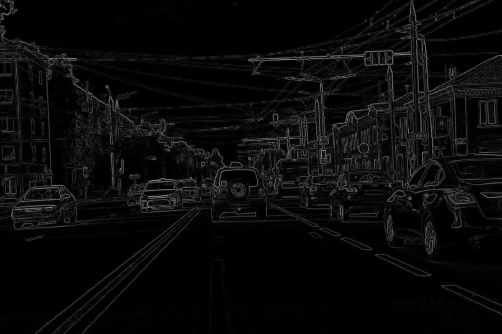
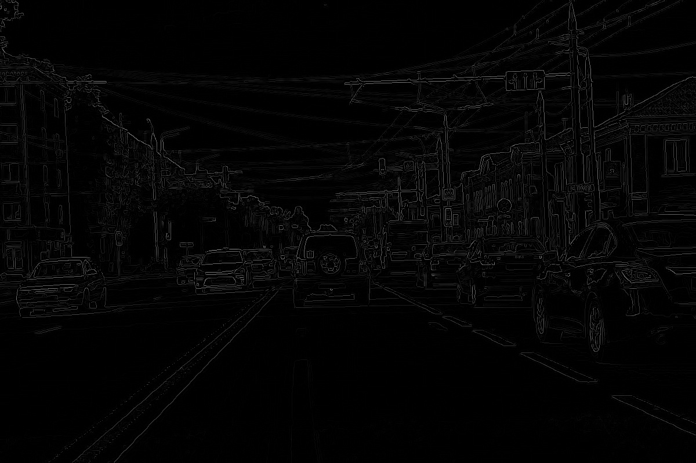
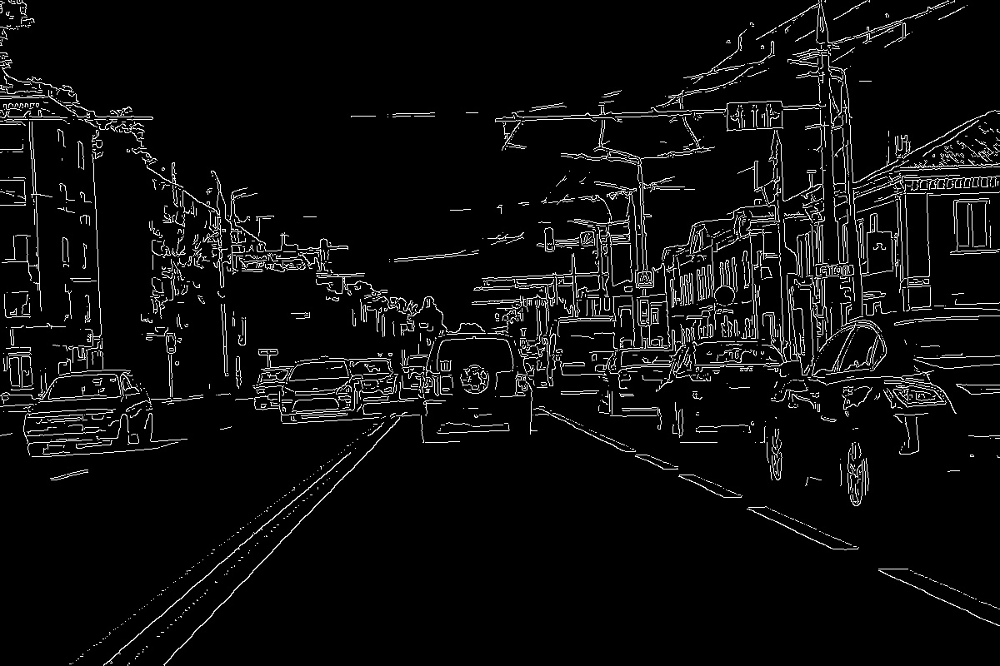

## PytorchCannyEdgeDetection 
Fully vectorized Pytorch implementation of the Canny Edge Detection Algorithm with hysteresis edge tracking as a Pytorch module. This project is intended to work on a GPU for high resolution images and image batches and real time edge detection. 

## Usage

---
You can just use it like a regular module:
```bash
import torch
import edge_detector as ce

getedge = ce.c_edge(upper_treshold = 40,lower_treshold = 20,max_iterations=10)

```

input – Grayscale Image utf-8 encoding - input tensor of shape (Batch,1,Height,Width)

output - torch.int32 tensor of shape (Batch,1,Height,Width) 

parameters:
```bash
kernel_size_gauss: int. 
sigma_gauss: float. 
kernel_size_sobel: int.
upper_treshold: float.
lower_treshold: float.
max_iterations: int. 
padding_mode: 'zeros', 'reflect', 'replicate', 'circular'.
precision: 'torch.float32', 'torch.float16'.
```

There are two examples for a simple image batch (test.py) and for real time video conversion using the webcam (webcam_test.py).

## Steps and implementation details:

---


<p style="text-align: center;"> original </p>

- Blur the grayscale image using a gaussian filter to remove noise.


- Calculate image gradients using a sobel filter.



- Minimum cut-off suppression to thin out edges and Gradient thresholding to distinguish between definite edge pixels and pixels that may belong to an edge.



- Follows chains of pixels to connect weak edge pixels to strong ones via edge tracking by hysteresis, If there is no connection to a strong pixel the weak pixel is discarted.



The gaussian blur and sobel kernel are implemented via seperable convolution and their kernel size can be freely choosen. Edge tracking by hysteresis is implemented using a parallel connected-components labeling algorithm to run efficinetly on a GPU, the algorithm is iterative. Usually a maximum of 5-8 iterations are more than enough.
